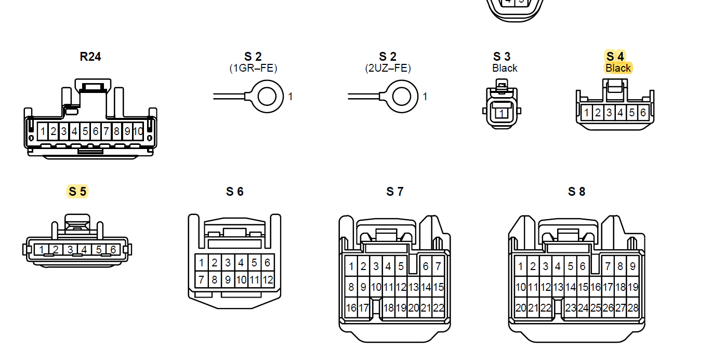

# 4Runner Seat Heat

#### Note
When cloning this repo, make sure to run `git clone --recurse-submodules` or similar, to grab the submodules. [Sourcetree](https://www.sourcetreeapp.com/) is an excellent GUI based git client that supports submodules.

## Why This Project?
This project is to add heated seats to my 06 4Runner, using the OEM switch (which are lovely) and generic heated seat pads. I had planned to replace the covers on my seats anyways, so adding heat pads was a low-cost upgrade.
There has been a fair amount of soul-searching about this in 4Runner forums over the years, so I thought I'd share what I learned.

# Challenges

## Toyota OEM Switches
Toyota makes really lovely heated seat switches for the 4Runner and FJ. These have backlighting, "heat-on" light and hardware status-quo across car power cycles. Basically you set the seat heat in November and not touch it again until April (your climate may vary).  
I like these switches a lot so with the help of the Toyota Service Manual reverse engineered them.

They also have individually sided plugs.

### Toyota Switch Part Numbers
| Function          | Switch Part Number | Harness Plug Part Number |
|-------------------|--------------------|--------------------------|
| Left Seat Switch  | 84751-35100        | 90980-10933              |
| Right Seat Switch | 84751-35090        | 90980-10964              |

There does seem to be someone selling these on [Alibab](https://www.alibaba.com/product-detail/seat-heater-switch-with-wire-harness_60582627051.html) if anyone orders one, let me know.

### Switch Plug Connectors
Thanks to both the Toyota4Runner forums and IH8Mud forums for the [following plug identification](https://www.ih8mud.com/tech/pdf/WireHarnessRepairManual/malenonw.pdf)

The left and right use the S5 and S4 connectors, respectively. Great, these aren't too hard to order from Toyota and ran me about $15 dollars for both.

### Switch Plug Pins
This is where thing went slightly off the rails. [This Toyota 4Runner Forum Post](https://www.toyota-4runner.org/3rd-gen-t4rs/259230-oem-type-connector-terminals.html) details the Toyota repair connector and gives rough dimensions on the pins. 

This yields part number: 82998-12340 which is roughly $6/each. This would bring **just the pins** to over $100 dollars.
Nope.

Through a combination of scattershot ordering, psychical testing and reading way too many catalogs, I found a part from TE Connectivity that fits perfectly.  

**TE 1743655-1**

In regular stock, this unit is ~$0.07 from the usual distributors. It can be crimped with a a $25 dollar knockoff crimper [like these](https://smile.amazon.com/IWISS-0-25-1-5MM%C2%B2-AWG24-16-Non-insulated-Terminals/dp/B089J6HM51/ref=sr_1_11?crid=2ZUS6ZI2XT7QJ&keywords=iwiss+crimper&qid=1640637604&sprefix=iwiss+crimper%2Caps%2C89&sr=8-11).

### Switch Wiring
When you take apart the switch you can see the following:

and

The Toyota wiring diagram (which can very likely be found on helpful forums) shows how the switches work in fairly clear detail.

The backlights aren't featured in the above diagrams and have to be sourced from a different page of the wiring diagram:

Toyota specifies the pin numbers as above, I mapped these numberings onto the switches themselves to have the following:

After taking apart one of the switches I have, I came up with the following KiCad symbol (see sub-project for complete library of KiCad parts).

We can see from the circuit diagram that the switch is kind enough to drive the "Heater On" light for us, so we don't need to control that one separately, although I guess we could if we wanted (by having another sink-side mosfet on pin 1).

### Switch Resistance
Now that we see how the switches work I toned them out to find the resistance at each detented point.
I used a Fluke 177 in resistance mode with a switch I bought on ebay, so values might shift a few percent.

| Position | Pin 2-3 Resistance (Ohms) |
|----------|---------------------------|
| Off      | 800k                      |
| Detent 1 | 3.5k                      |
| Detent 2 | 2.78k                     |
| Detent 3 | 1.8k                      |
| Detent 4 | 483                       |
| Maximum  | 330                       |

In the PCB, I opted to go with a few circuits to allow these values to scale nicely. 
- A voltage divider and analog pin that measures the 12VDC circuit in the car (this uses 1% resistors to allow for greater accuracy
- Another voltage divider and analog pin for each side that measures the switch position.
- Another voltage divider and analog pin to look for status about the vehicle lights (either on or off, mainly)

With a bit of math we can always scale the resistance reading to be a percentage of the 12VDC reading, so even as our alternator voltage drifts a bit (it will), our intended output stays the same.

### Switch Backlights
In the PCB I've made, I chose to drive the backlights directly, with input signaling being read from another analog input pin, although since they're wheatlamps, I can certainly dim them with PWM.

Inside each unit there are two lights, one (a wheatlamp) for the backlight and the other (an LED with load resistor) for the "Heat On" function. See:
The wheatlamp:

The LED:

One of the ebay units I purchased had a dead backlight, so I found the replacement bulbs.

Some resellers will sell a bulb with flying leads. I was looking for the entire assembly (which is used in a few other places in the 4Runners, mainly behind the dash).

| Lamp          | Lens        | Color      |
|---------------|-------------|------------|
|**JKL-CNW1-23**| JKL 39-20-1 | Red        |
|               | JKL 39-20-2 | Orange     |
|               | JKL 39-20-3 | **Yellow** |
|               | JKL 39-20-4 | Green      |
|               | JKL 39-20-5 | Blue       |
|               | JKL 39-20-6 | Blue-White |
|               | JKL 39-20-7 | White      |

## New Center Console

In order to accommodate the heated seat swtiches, the center console cover needs to have the correct cutouts. Mine did not come with this from the factory, so I found another 4Runner that did and traced the part number.

The center console (in grey) is: Toyota part number 58822-35020-B0

This is a representative photo (in the correct color) of the above part number:
	

