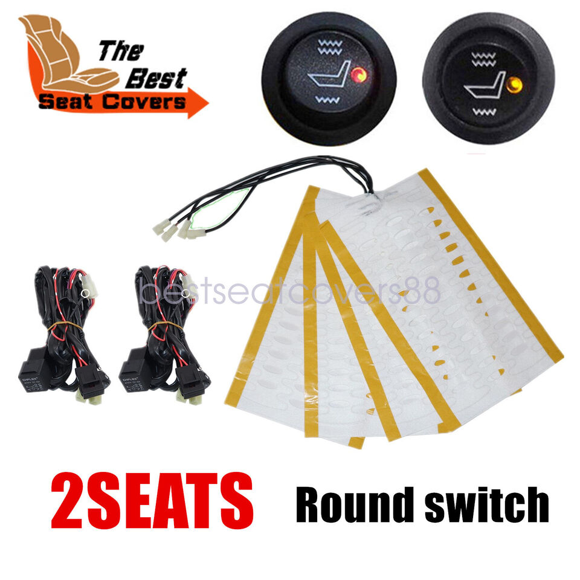

# 4Runner Seat Heat

#### Note
When cloning this repo, make sure to run `git clone --recurse-submodules` or similar, to grab the submodules.

## Links
[**3d Printed Case**](https://github.com/alorman/4Runner-Seat-Heat-Case/tree/main)  
[**Code to Run on Teensy**](https://github.com/alorman/4Runner-Seat-Heat-Code/tree/main)  
[**PCB**](https://github.com/alorman/4runner-Seat-Heat-PCB/tree/main)  

## Why This Project?
This project is to add heated seats to my 06 4Runner, using the OEM switch (which are lovely) and generic heated seat pads. I had planned to replace the covers on my seats anyways, so adding heat pads was a low-cost upgrade.
There has been a fair amount of soul-searching about this in 4Runner forums over the years, so I thought I'd share what I learned.

# Challenges

## Toyota OEM Switches
Toyota makes really lovely heated seat switches for the 4Runner and FJ. These have backlighting, "heat-on" light and hardware status-quo across car power cycles. Basically you set the seat heat in November and not touch it again until April (your climate may vary).  
I like these switches a lot so with the help of the Toyota Service Manual reverse engineered them.


They also have individually sided plugs.


### Toyota Switch Part Numbers
| Function          | Switch Part Number | Harness Plug Part Number |
|-------------------|--------------------|--------------------------|
| Left Seat Switch  | 84751-35100        | 90980-10933              |
| Right Seat Switch | 84751-35090        | 90980-10964              |

There does seem to be someone selling these on [Alibaba](https://www.alibaba.com/product-detail/seat-heater-switch-with-wire-harness_60582627051.html) if anyone orders one, let me know.

### Switch Plug Connectors
Thanks to both the Toyota4Runner forums and IH8Mud forums for the [following plug identification](https://www.ih8mud.com/tech/pdf/WireHarnessRepairManual/malenonw.pdf). It that link is dead [I hosted a copy](manuals/wire-harness-repair-manual-MALE.pdf) 


The left and right use the S5 and S4 connectors, respectively. Great, these aren't too hard to order from Toyota and ran me about $15 dollars for both.

### Switch Plug Pins
This is where thing went slightly off the rails. [This Toyota 4Runner Forum Post](https://www.toyota-4runner.org/3rd-gen-t4rs/259230-oem-type-connector-terminals.html) details the Toyota repair connector and gives rough dimensions on the pins. 

This yields part number: 82998-12340 which is roughly $6/each. This would bring **just the pins** to over $100 dollars.
Nope.

Through a combination of scattershot ordering, psychical testing and reading way too many catalogs, I found a part from TE Connectivity that fits perfectly.  

**TE 1743655-1**


In regular stock, this unit is ~$0.07 from the usual distributors. It can be crimped with a a $25 dollar knockoff crimper [like these](https://smile.amazon.com/IWISS-0-25-1-5MM%C2%B2-AWG24-16-Non-insulated-Terminals/dp/B089J6HM51/ref=sr_1_11?crid=2ZUS6ZI2XT7QJ&keywords=iwiss+crimper&qid=1640637604&sprefix=iwiss+crimper%2Caps%2C89&sr=8-11).

### Switch Wiring
When you take apart the switch you can see the following:

and


The Toyota wiring diagram (which can very likely be found on helpful forums and is impractically large to host in full here) shows how the switches work in fairly clear detail.


The backlights aren't featured in the above diagrams and have to be sourced from a different page of the wiring diagram:


and more importantly:


Toyota specifies the pin numbers as above, I mapped these numberings onto the switches themselves to have the following:


After taking apart one of the switches I have, I came up with the following KiCad symbol (see sub-project for complete library of KiCad parts).


We can see from the circuit diagram that the switch is kind enough to drive the "Heater On" light for us, so we don't need to control that one separately, although I guess we could if we wanted (by having another sink-side mosfet on pin 1).

### Switch Resistance
Now that we see how the switches work I toned them out to find the resistance at each detented point.
I used a Fluke 177 in resistance mode with a switch I bought on ebay, so values might shift a few percent.

| Position | Pin 2-3 Resistance (Ohms) |
|----------|---------------------------|
| Off      | 800k                      |
| Detent 1 | 3.5k                      |
| Detent 2 | 2.78k                     |
| Detent 3 | 1.8k                      |
| Detent 4 | 483                       |
| Maximum  | 330                       |

In the PCB, I opted to go with a few circuits to allow these values to scale nicely. 
- A voltage divider and analog pin that measures the 12VDC circuit in the car (this uses 1% resistors to allow for greater accuracy
- Another voltage divider and analog pin for each side that measures the switch position.
- ~~Another voltage divider and analog pin to look for status about the vehicle lights (either on or off, mainly)~~ this feature is depricated with rev02 of the PCB.

With a bit of math we can always scale the resistance reading to be a percentage of the 12VDC reading, so even as our alternator voltage drifts a bit (it will), our intended output stays the same.

### Switch Backlights
~~In this PCB the backlights are driven via the same Green - White/Green circuitry that drives all the gauge backlights. There is an option to drive the backlights directly if desired.~~

In PCB rev02 I realized I hadn't quite fully understood how the backlight dimming worked. In short: it's switched high-side and dimmed low-side, so the easiest path was to allow the backlights to be directly driven by the car's backlight system rather than driving them through a mosfet. 


  

Inside each unit there are two lights, one (a wheatlamp) for the backlight and the other (an LED with load resistor) for the "Heat On" function. See:
The wheatlamp:


The LED:


## Wiring Harness
Using the awesome [Wirely Harness Tool](https://wirely-harness.com/) I made a quick harness diagram for the connectors that must be made from the board to the switches, car and heater.


See the full [JSON Definition](wirely-harness/4Runner-Heated-Seat-Wiring.json)  

## Replacement Bulbs
One of the ebay units I purchased had a dead backlight, so I found the replacement bulbs.

**The bulbs are T1 style incandescent bulbs**

Some resellers will sell a bulb with flying leads. I was looking for the entire assembly (which is used in a few other places in the 4Runners, mainly behind the dash).

| Lamp          | Lens         | Color      |
|---------------|--------------|------------|
|**JKL CNW1-23**| JKL 39-02-1A | Red        |
|               | JKL 39-02-2A | Orange     |
|               | JKL 39-02-3A | **Yellow** (what we're using here)|
|               | JKL 39-02-4A | Green      |
|               | JKL 39-02-5A | Blue       |
|               | JKL 39-02-6A | Blue-White |
|               | JKL 39-02-7A | White      |

Replacement bulbs (as opposed to holders) are available from JKL as part number 23 (note: JKL, please find a more unique part number). Available from Mouser [here](https://www.mouser.com/ProductDetail/JKL-Components/23?qs=gp8goBkfC5ERjlYH8%2FoU0w%3D%3D)

## New Center Console

In order to accommodate the heated seat switches, the center console cover needs to have the correct cutouts. Mine did not come with this from the factory, so I found another 4Runner that did and traced the part number.

The center console (in grey) is: Toyota part number `58822-35020-B0`

This is a representative photo (in the correct color) of the above part number:
	

## PCB
See the [PCB repo](https://github.com/alorman/4runner-Seat-Heat-PCB) for further details  

I designed the PCB in KiCad to accomade these signals. 

Front:
  

Back:


The main challenge of the board was to compactly conduct the appropriate current (~10A DC) per channel. This was done with heavy duty SMT MOSFETs that accept logic-level inputs from the Teensy. 

The Teensy is total overkill for this project, but it was easy and I always have a few floating around. It supports my limited programming skills.

## Code
See the [Code Repo](https://github.com/alorman/4Runner-Seat-Heat-Code) for full details. 

The main interesting part of this code was using a low-rate PWM. The MOSFET was being switched to fast to fully avalanche and thus was causing the MOSFET resistance to be far too high to enter into an overheat cycle. Since there is significant thermal inertia in the heaters and seats themselves, a _much_ slower PWM rate will allow the MOSFET to fully avalanche without exploding. For extra bonus points, the heaters themselves really become higher resistance as they heat up, so they are, in a way, self regulating at full power.  
I used the `GlobalPWMFreq` directive to limit the frequency.   
In the global definitions I put:  
```
int GlobalPWMFreq = 1000;
```


## Seat Heaters

The entire aim of this project was to use commodity seat heaters and the OEM switches. I purchased a pair of seat heaters and included cabling and hardware from eBay similar to [these](https://www.ebay.com/itm/314946346242?hash=item495443dd02:g:S~AAAOSwfXJlk2pL) for around $60. (Link may be dead. Photo below))  



These come in numerous styles, but the only thing of importance was the heater pads themselves. We won't be using the switches or relays.  

I replaced the my seat covers with leather from the lovely people at [Lseat.com](www.lseat.com).  
**Pro Tip** Hog rings are the worst. Use aviation snips to cut the hog rings when you take the seat apart then use small zip ties when you put it back together. Future you will thank you.

### Heating Pad Wiring Notes
My seat heat pads had a strange wiring scheme that took me some time to realize. The pads were wired in some kind of strange series/parallel configuration. I ended up cutting connectors off and rewiring them in parallel to both pads. 


